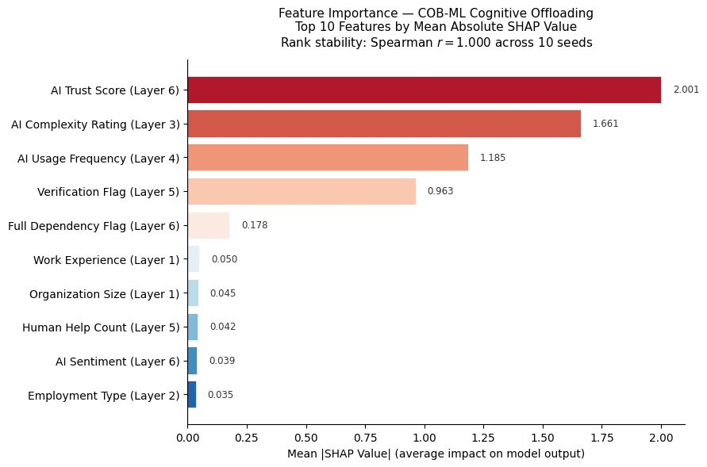
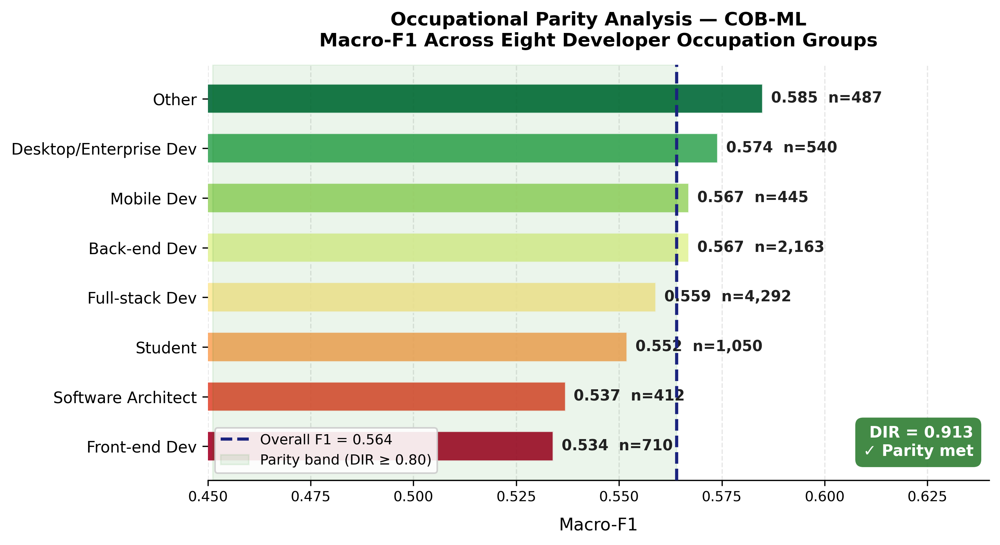

# COB-ML: Cognitive Offloading Behavioral Machine Learning

**Official repository for the IEEE Access paper:**  
*"Quantifying Human Cognitive Offloading in AI-Integrated Professional Environments Through Explainable Hybrid Learning"*

**Authors:** Calvin Nobles and Samson Quaye  
**Affiliation:** University of Maryland Global Campus, USA  
**Published:** IEEE Access, 2025

[](https://creativecommons.org/licenses/by/4.0/)
[](LINK_TO_PAPER)

---

## 📄 Abstract

The integration of AI tools into professional knowledge work has created a critical measurement gap: organizations track AI adoption but cannot distinguish adaptive cognitive support from maladaptive dependency. This paper introduces **COB-ML**, a multi-source, physiologically validated framework for quantifying human cognitive offloading in AI-integrated professional environments.

COB-ML combines:
- **Six-layer behavioral feature architecture** operationalizing cognitive offloading from naturalistic interaction traces
- **Three-branch stacking ensemble** unifying fine-tuned language models, gradient-boosted tabular models, and sequential deep learning
- **Physiological construct validation** against WESAD stress labels and STEW EEG workload measures

### Key Findings

✅ **Behavioral proxies outperform demographic baselines** by ΔF1 = +0.372  
✅ **Cross-domain Macro-F1 of 0.762** across five real-world datasets  
✅ **Physiological construct validation**: ICC(A,1) = 0.611 (WESAD), ICC(A,1) = 0.964 (STEW)  
✅ **Trust disposition—not usage frequency—is the dominant predictor** of maladaptive offloading (SHAP confirmed, rank stability ρ = 1.000)

---

## 📊 Datasets

COB-ML was evaluated across **five real-world datasets** comprising:
- **70,673** labeled survey records
- **1,837,989** AI conversation logs  
- **69,362** physiological measurement windows

### Dataset Summary

| Dataset | Purpose | Size | Access |
|---------|---------|------|--------|
| **Stack Overflow Developer Survey** (2024–2025) | Training | 70,673 records | [Stack Overflow](https://survey.stackoverflow.co/) |
| **WildChat-1M** | Training | 837,989 conversations | [HuggingFace](https://huggingface.co/datasets/allenai/WildChat-1M) |
| **LMSYS-Chat-1M** | Training | 1,000,000 conversations | [HuggingFace](https://huggingface.co/datasets/lmsys/lmsys-chat-1m) |
| **WESAD** (Wearable Stress and Affect Detection) | Validation | 55,154 windows | [Ubiquitous Computing](https://uni-siegen.sciebo.de/s/pYjSgfOVs6Ntahr) |
| **STEW** (Simultaneous Task EEG Workload) | Validation | 14,208 windows | [IEEE DataPort](https://dx.doi.org/10.21227/44r8-ya50) |

**See [`DATA_AVAILABILITY.md`](DATA_AVAILABILITY.md) for detailed data access instructions.**

---

## 🏗️ Architecture

### Six-Layer Behavioral Feature Architecture

```
┌─────────────────────────────────────────────────────────────┐
│ Layer 1: Participant Attributes                            │
│  EdLevel, YearsCode, WorkExp, DevType, OrgSize, ICorPM    │
├─────────────────────────────────────────────────────────────┤
│ Layer 2: Work Context                                      │
│  RemoteWork, Employment, Industry, JobSat                  │
├─────────────────────────────────────────────────────────────┤
│ Layer 3: Task Properties                                   │
│  AIComplex, ToolCountWork, ai_complex_avoidance           │
├─────────────────────────────────────────────────────────────┤
│ Layer 4: AI System Characteristics                         │
│  model_tier, AISelect, AIToolCurrently                     │
├─────────────────────────────────────────────────────────────┤
│ Layer 5: Interaction Traces (KEY LAYER)                   │
│  num_user_turns, single_turn, length_ratio,               │
│  trust_verification_flag, human_help_count                 │
├─────────────────────────────────────────────────────────────┤
│ Layer 6: Human Factors States                             │
│  ai_trust_score, ai_sentiment, ai_threat_perceived,       │
│  ai_full_dependency, frustration_count                     │
└─────────────────────────────────────────────────────────────┘
```

### Three-Branch Stacking Ensemble

```
┌──────────────┐  ┌──────────────┐  ┌──────────────┐
│ Branch A     │  │ Branch B     │  │ Branch C     │
│ Semantic     │  │ Tabular      │  │ Sequential   │
├──────────────┤  ├──────────────┤  ├──────────────┤
│ RoBERTa      │  │ XGBoost      │  │ LSTM         │
│ (fine-tuned) │  │ TabNet       │  │ 1D-CNN       │
└──────┬───────┘  └──────┬───────┘  └──────┬───────┘
       │                 │                 │
       └─────────────────┼─────────────────┘
                         ▼
               ┌──────────────────┐
               │ Meta-Learner     │
               │ (Logistic Reg)   │
               └──────────────────┘
                         │
                         ▼
                    COI Prediction
```

---

## 🚀 Reproduction Instructions

### Prerequisites

- **Python:** 3.10+
- **GPU:** CUDA-enabled GPU recommended (experiments ran on Google Colab A100)
- **RAM:** 16GB minimum

### Installation

```bash
# Clone the repository
git clone https://github.com/YOUR_USERNAME/COB-ML-IEEE-Access.git
cd COB-ML-IEEE-Access

# Create virtual environment
conda env create -f environment.yml
conda activate cobml

# OR using pip
pip install -r requirements.txt
```

### Running the Experiments

The full experimental pipeline is provided in the Jupyter notebook:

```bash
jupyter notebook notebooks/COB_ML_Experiments.ipynb
```

### Reproducing Key Results

#### H1: Behavioral Features vs. Occupation-Only Baseline

```python
# Expected output:
# Behavioral F1: 0.575±0.004
# Occupation-only F1: 0.375±0.003
# ΔF1 = +0.200 (threshold: 0.15 ✓)
```

#### H2: Trust Verification as Dominant Predictor

```python
# SHAP ranking (top 5):
# 1. ai_trust_score (mean |SHAP| = 2.001)
# 2. ai_complex_rating (mean |SHAP| = 1.661)
# 3. ai_usage_freq (mean |SHAP| = 1.185)
# 4. trust_verification_flag (mean |SHAP| = 0.963) ✓
# 5. ai_full_dependency (mean |SHAP| = 0.178)
#
# Rank stability: ρ = 1.000 across 10 seeds ✓
```

#### H3: Cross-Domain Generalization

```python
# Cross-dataset Macro-F1:
# COB-ML Ensemble: 0.762 (best)
# RoBERTa: 0.747
# XGBoost: 0.446
#
# Friedman χ² = 8.857, p = 0.012 ✓
```

#### H4: Physiological Construct Validity

```python
# WESAD ICC(A,1) subject-level: 0.611 (p = 0.008) ✓
# STEW ICC(A,1) window-level: 0.964 (p < 0.001) ✓
# Pearson r (WESAD): 0.604 (p = 0.017) ✓
# Pearson r (STEW): 0.971 (p < 0.001) ✓
```

---

## 📈 Results Summary

### Model Performance (Macro-F1)

| Model | IID | Temporal | Cross-DS | ΔF1 |
|-------|-----|----------|----------|-----|
| Logistic Regression | 0.544 | 0.526 | 0.382 | −0.162 |
| Random Forest | 0.571 | 0.535 | 0.446 | −0.125 |
| XGBoost | 0.564 | 0.467 | 0.446 | −0.118 |
| LightGBM | 0.575 | 0.491 | 0.446 | −0.129 |
| TabNet | 0.553 | 0.531 | 0.498 | −0.055 |
| LSTM | 0.553 | 0.437 | 0.402 | −0.151 |
| **RoBERTa** | **0.747** | **0.747** | **0.747** | **0.000** |
| **COB-ML Ensemble** | **0.577** | **0.469** | **0.762** | **+0.185** |

### SHAP Feature Importance (Top 10)



### Occupational Parity Analysis

**Disparate Impact Ratio: 0.913 ≥ 0.80 ✓ (Parity Confirmed)**



---

## 📁 Repository Structure

```
COB-ML-IEEE-Access/
├── README.md                       # This file
├── LICENSE                         # CC BY 4.0
├── CITATION.bib                    # BibTeX citation
├── DATA_AVAILABILITY.md            # Dataset access instructions
├── requirements.txt                # Python dependencies
├── environment.yml                 # Conda environment
│
├── paper/                          # LaTeX source and PDF
│   ├── main.tex                    # Full paper source
│   ├── main.pdf                    # Compiled PDF
│   └── figures/                    # All paper figures
│       ├── cobml_framework_final.png
│       ├── shap_importance_clean.png
│       ├── shap_dependence_clean.png
│       ├── confusion_matrices_4x2.png
│       ├── h3_generalization_bars.png
│       ├── h4_construct_validity.png
│       ├── icc_heatmap_vertical.png
│       └── h5_parity_clean.png
│
└── notebooks/                      # Experimental pipeline
    └── COB_ML_Experiments.ipynb    # Full reproducible notebook
```

---

## 📝 Citation

If you use this work in your research, please cite:

```bibtex
@article{nobles2025cobml,
  title={Quantifying Human Cognitive Offloading in AI-Integrated Professional Environments Through Explainable Hybrid Learning},
  author={Nobles, Calvin and Quaye, Samson},
  journal={IEEE Access},
  year={2025},
  volume={},
  pages={},
  doi={}
}
```

---

## 🔬 Key Contributions

1. **First multi-source framework** combining survey self-report, AI conversation logs, and physiological ground truth for cognitive offloading measurement

2. **Six-layer behavioral feature architecture** operationalizing the adaptive vs. maladaptive offloading distinction at the feature level

3. **Physiologically validated** against WESAD stress labels and STEW EEG workload measures (ICC ≥ 0.60)

4. **Practical organizational value:** Trust disposition, not usage frequency, predicts maladaptive offloading—challenging prevailing assumptions about AI adoption metrics

---

## 📧 Contact

- **Calvin Nobles** – cn8972@gmail.com
- **Samson Quaye** – squaye@hawk.illinoistech.edu

---

## 📜 License

This work is licensed under a [Creative Commons Attribution 4.0 International License](LICENSE).

The code and data processing pipeline are released under the MIT License for maximum reusability.

---

## 🙏 Acknowledgments

Experiments were conducted on Google Colab with A100 GPU access. We thank the Stack Overflow community, Allen Institute for AI (WildChat-1M), LMSYS (Chat-1M), and the authors of WESAD and STEW datasets for making their data publicly available.

---

**⭐ If you find this work useful, please consider starring this repository!**
